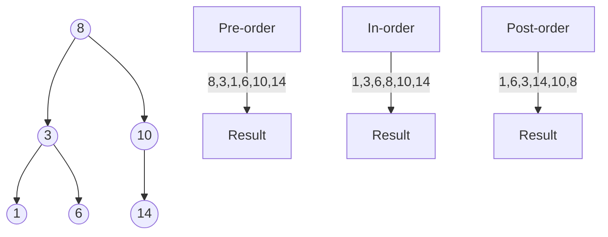

import { CodeBlock } from '@/components/codeblock';

Welcome to the docs! You can start writing documents in `/content/docs`.

## Introduction

```ts twoslash
// [!code word:log]
const a = 1;
console.log(a+7); // [!code --]

const hi = 'Hello'
const msg = `${hi}, world`
//    ^?
```

<CodeBlock lang />


```typescript twoslash
// @noErrors
console.l
//       ^|


// ---cut-start---
// ---cut-end---

// ---cut-start---
// ---cut-end---

//
```

```ts twoslash
// @errors: 1005
const a = '123';
console.log(;
```

```ts ts2js
const name: string = "Aman"
const isStudent: boolean = true
```


### 1. **Recurrence Relation:**
```math
T(n) = T(n-1) + O(1)
```

### 2. **Time Complexity - Double Sum:**
```math
O(n^2) = \sum_{i=1}^n \sum_{j=1}^n 1
```

### 3. **Space Complexity:**
```math
\text{Space}(n) = O(h) = O(\log n)
```

### 4. **Arithmetic Sequence:**
```math
a_{i+1} = a_i + d
```

### 5. **Sum of Arithmetic Sequence:**
```math
S = \frac{n}{2}(a_1 + a_n)
```


